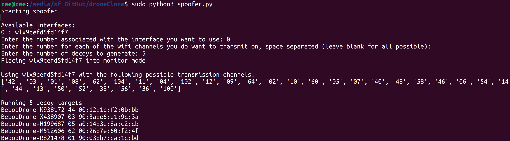
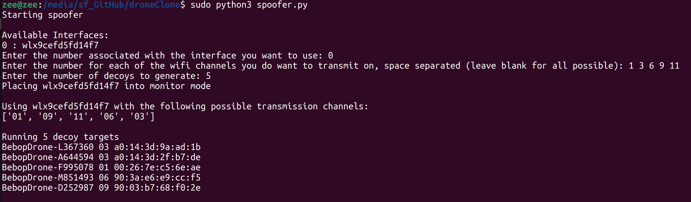

# Naruto

Reclaim the sky with the power of Kage Bunshin no Jutsu

## What Is It?

Naruto is a python based toolkit designed to generate RF decoys of valid drones so as to overwhelm and confuse opposing Counter-Unmanned Aerial Systems (C-UAS) systems.  It takes advantage of the fact that many modern small drones now use WiFi as their control data link, making it easy to generate false targets on relatively cheap hardware.  It works on C-UAS systems that target small group one drones, and use Radio Frequency (RF) analysis to track and detect drones.  

## How To Use

### Hardware

Because we use Scapy and iwconfig, we need a wireless network card, however because of the systems we are targeting, you don't actually need any sort of high power transmitter.  As such pretty much any cheap WiFi dongle will do.  

For my own testing, I used this hardware setup:

- [Panda Wifi Dongle](https://www.amazon.com/Panda-Wireless®-Wireless-Adapter-Antennas/dp/B0B2QD6RPX/)
  - Note, any $20 to $30 dongle will do, this one was $30 when I bought it
- [Raspberry Pi](https://www.raspberrypi.com/products/)
  - Note, this is only needed if you want to run the toolkit remotely and not on your laptop or desktop
  - I've tested the toolkit on both the Pi 4 and Pi 5

### Software

#### Setup

  Before running the spoofing software, you must first make a profile of the drone type you are trying to spoof.  This contains the MAC addresses associated with the drone manufacturer and the naming convention of the drone's SSID.  The files used to generate the MAC list can be updated by running the [vendor updater](./vendorUpdater.py) python script when connected to the internet.  

  Running the [profile generator](./profileGenerator.py) script can be done offline, since it uses the local copy of the vendor lists.  After using it, you will create a YAML config file that represents the drone you are trying to make decoys of.  An example of what one looks like is below:

```yaml
    startString: BebopDrone-
    endString: LNNNNNN
    macs:
    - 903AE6
    - 00121C
    - 9003B7
    - A0143D
    - 00267E
```

Here you can see the profile for Parrots Bebop2 drones.  Each drone SSID begins with the phrase Bebop Drone, and the contains one letter following by a string of numbers that represent the serial number of the actual drone.  The list of MAC addresses are all the known MAC blocks that have been assigned to Parrot, the company that makes Bebop drones.  

#### Spoofer

Once you have built your drone profile, you are ready to transmit using the [spoofer script](./spoofer.py).  The script is interactive and will walk you through selecting a wifi interface and drone profile.  

While running, the script will generate beacon broadcast packets for each of the decoys on the channel that the decoy is supposed to transmit on.  After each cycle of generating packets, we shuffle the decoy list so as to keep the order of transmissions random.  

| |
| --- |
|  |
| An example of running the spoofer script where you transmit on all possible channels. |
|  |
| An example of running the spoofer script where you transmit only on user defined WiFi channels. |

